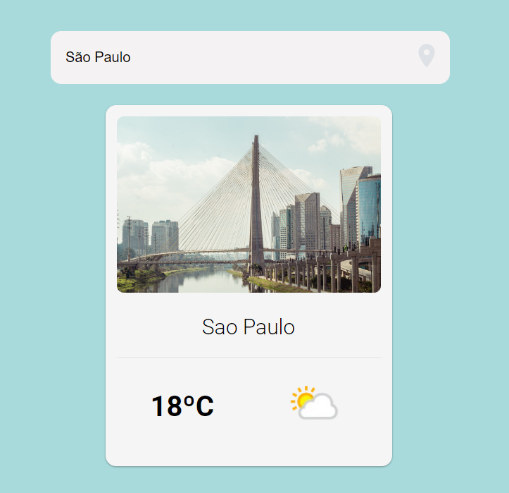

# Projeto Weather

## Sobre o projeto
Esse projeto foi feito para fins de estudos e prática sobre a biblioteca React para o JavaScript.
Você faz a pesquisa com o nome da cidade e ele retorna o clima daquele lugar em tempo real e uma imagem do local.
Para isso, foi utilizado a API do WeatherAPI e Unsplash para as imagens.

## Exemplos
Nesta primeira imagem, temos a pesquisa São Paulo e é retornada uma foto da cidade a temperatura e um icone do tempo.

