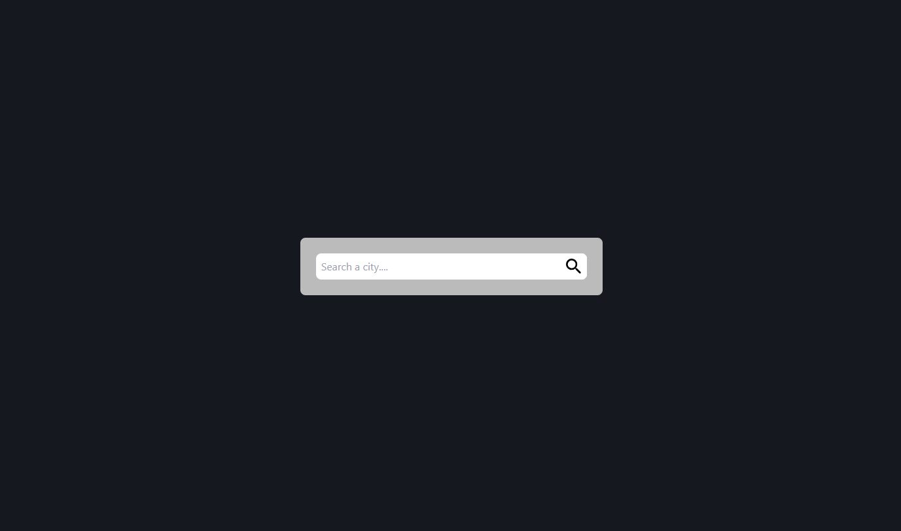
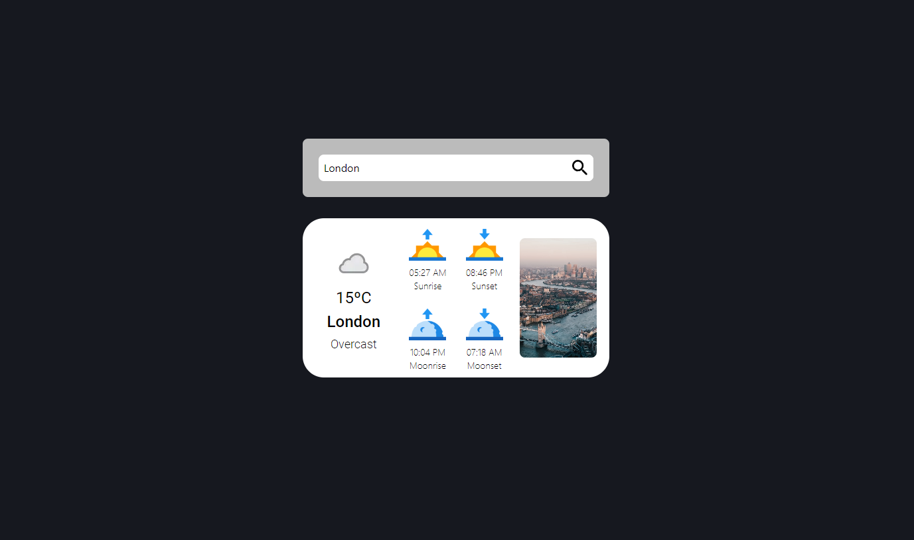
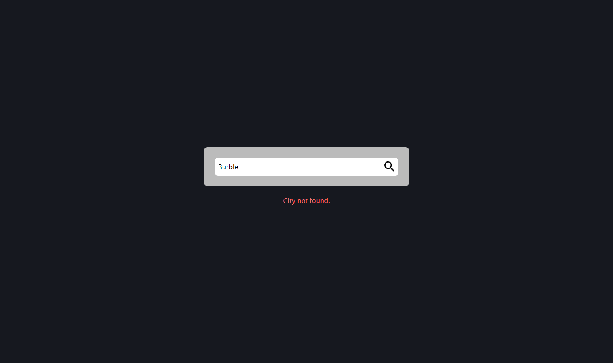

# Weather App
Weather App is a React and Tailwind-based application that utilizes the Weatherapi and Unsplash APIs. This app retrieves the current weather for a searched city, along with sunrise, sunset, and moon phase information, along with an image of the searched location.

# Technologies Used
- HTML
- CSS (with Tailwind CSS)
- React.js

# Installation
To get started with this project, follow these steps:
- Use `git clone https://github.com/JvTadeo/project-weather.git` to clone this repository.
- Once you have cloned the project, navigate to the project directory: `cd project-weather`
- Next, you need to install the project dependencies. Run the following command: `npm install`
- Now, simply run `npm start` to start the server.

Now you're all set up and ready to use the project

# Images
>Index

> Search City

> City Not Found

